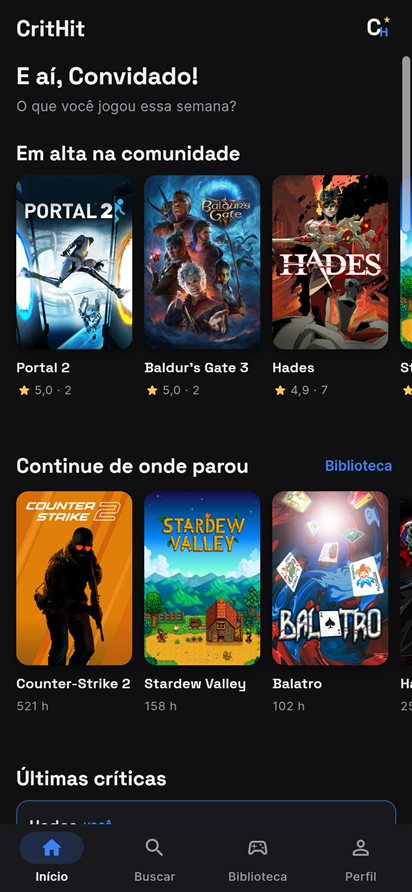
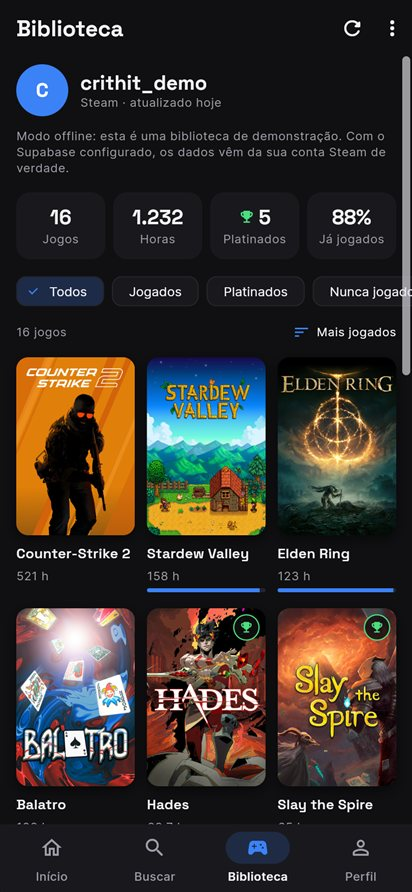
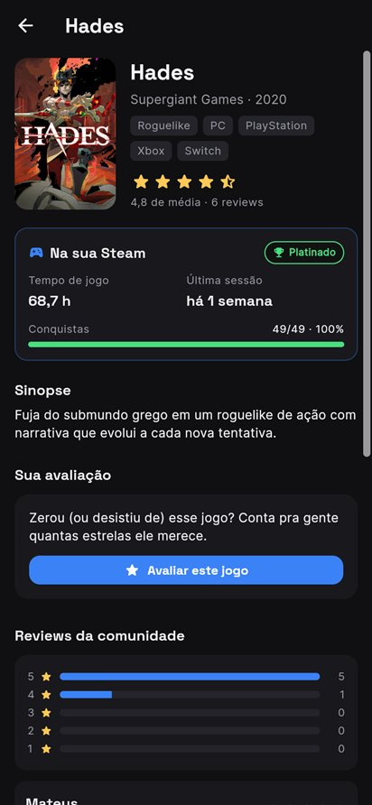
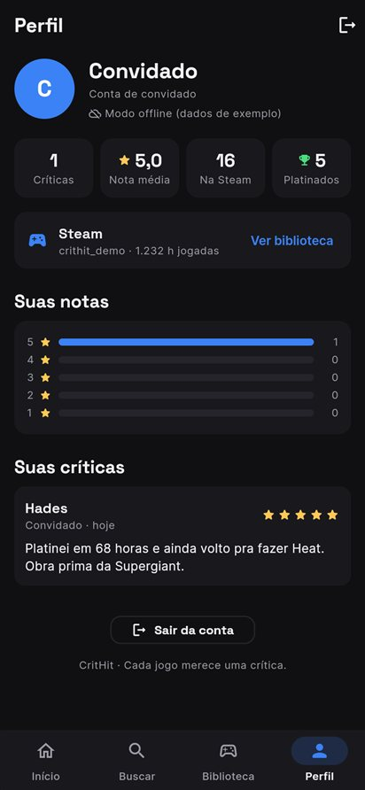
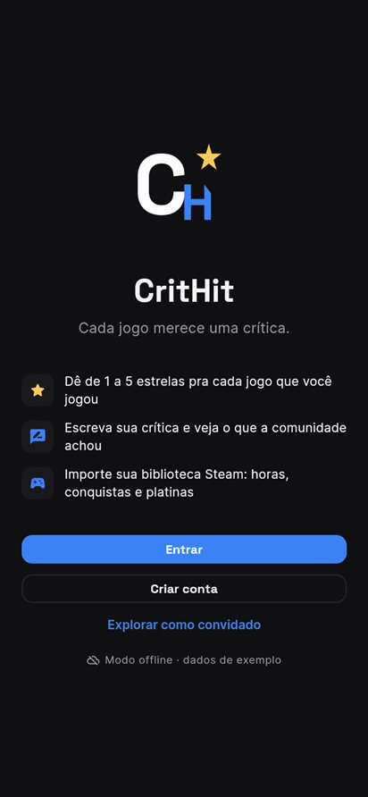
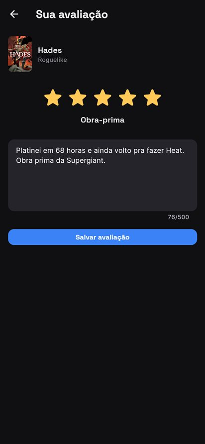
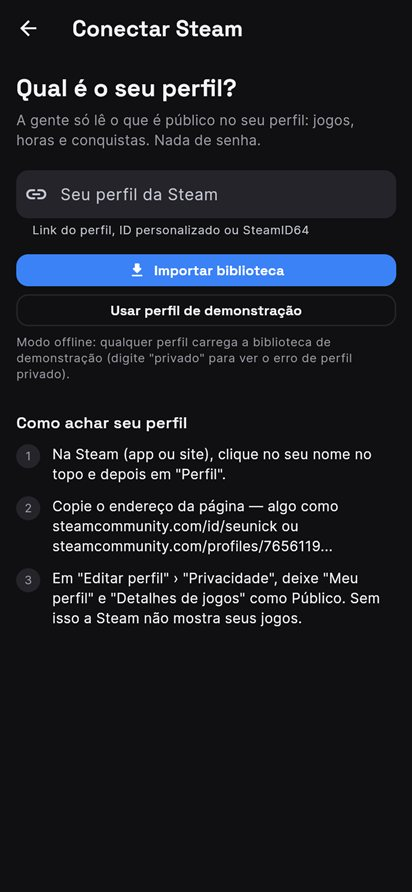
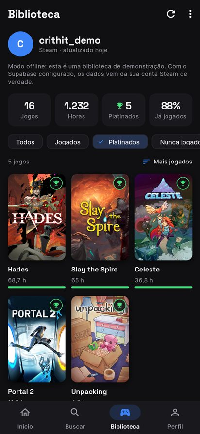
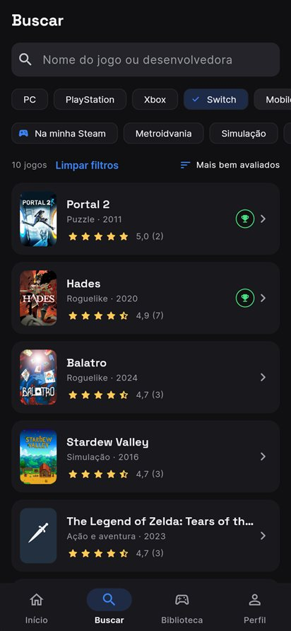

# CritHit

**"Letterboxd para jogos"**: registre os jogos que você jogou, dê uma nota de 1 a 5 estrelas e escreva sua crítica, exatamente como você faria numa plataforma de avaliação de filmes. E, desde o Checkpoint 5, **importe sua biblioteca Steam** inteira, com horas jogadas, conquistas e platinas, sem cadastrar jogo por jogo.

Projeto integrado da disciplina **Cross-Platform Application Development** (Ciência da Computação, 2º ano), desenvolvido em **Flutter/Dart** ao longo dos Checkpoints 4, 5 e 6.

<p>
  
  
  
  
</p>

## Proposta de valor

Hoje, avaliar jogos é uma experiência fragmentada: nota de crítica especializada num site, review de compra na loja digital, opinião pessoal perdida em um grupo do WhatsApp. O **CritHit** junta tudo isso em um único lugar, focado exclusivamente na experiência pessoal de quem joga: um catálogo de jogos onde qualquer pessoa pode dar sua nota (1 a 5 estrelas) e escrever uma crítica, além de ver o que a comunidade achou de cada jogo.

Veja a documentação completa do produto em [`docs/PRODUCT.md`](docs/PRODUCT.md), a identidade de marca em [`docs/BRANDING.md`](docs/BRANDING.md), o pitch de negócio em [`docs/PITCH.md`](docs/PITCH.md) e o guia de configuração do banco e da Steam em [`docs/SUPABASE_E_STEAM.md`](docs/SUPABASE_E_STEAM.md).

## Integrantes do grupo

| Nome | RM | Papel no projeto |
|---|---|---|
| Felipe Krzyanovski do Santos Menezes | 564878 | Coordenação geral / Product Owner |
| Lucas Ferrari Lima | 563119 | Desenvolvimento Geral do App |
| Carlos Eduardo Pires Cervelli | 563462 | Apoio ao Desenvolvimento e Organização do Repositório |
| Leonardo Lopes Oliveira | 565437 | Identidade visual: logo, paleta de cores, tipografia, Figma |
| Arthur de Souza Matos Dias | 566068 | Documentação: problema, público-alvo, MVP (`docs/PRODUCT.md`) |
| Guilherme Carreri Giampietro | 565676 | Pitch: modelo de negócio e diferencial competitivo (`docs/PITCH.md`) |
| Mateus Patricio Pereira | 564695 | QA/Testes: validação do build |

## Status por Checkpoint

- [x] **Checkpoint 4 (Idealização)**: marca, identidade visual, documentação inicial, pitch e projeto Flutter inicial rodando com tela inicial (catálogo mockado) e fluxo de avaliação por estrelas.
- [x] **Checkpoint 5 (Protótipo funcional)**: fluxo completo do MVP navegável, dados mockados realistas, banco de dados Supabase integrado, importação da biblioteca Steam e ambiente de teste (Chrome/Windows) configurado.
- [ ] **Checkpoint 6 (App final)**: MVP completo, documentado e empacotado em APK.

### Entregáveis do Checkpoint 5

| Entregável pedido | Onde está |
|---|---|
| Protótipo funcional com dados mockados | `lib/data/`: 17 jogos, 43 reviews de exemplo e uma biblioteca Steam de demonstração com 16 jogos |
| Navegação entre telas (fluxo principal completo) | 10 telas, ver [Fluxo de telas](#fluxo-de-telas) |
| Integração de banco de dados (Supabase ou Firebase) | **Supabase**: login, perfis e reviews no Postgres com RLS (`supabase/migrations/`) |
| Ambiente de teste configurado | Flutter Web (Chrome) e Windows desktop; pastas `web/`, `windows/` e `android/` geradas |
| Documentação atualizada | Este README + [`docs/SUPABASE_E_STEAM.md`](docs/SUPABASE_E_STEAM.md) |
| Simulação demonstrável em aula | `flutter run -d chrome` (funciona até sem internet, no modo offline) |

## Fluxo de telas

```
Boas-vindas ──► Entrar / Criar conta ──┐
     └──────► Explorar como convidado ─┤
                                       ▼
        ┌──────────── barra de navegação inferior ────────────┐
        │  Início        Buscar        Biblioteca      Perfil  │
        └─────────────────────────────────────────────────────┘
  Início: em alta, continue de onde parou (Steam), últimas críticas, catálogo
  Buscar: busca por nome/desenvolvedora + filtros (plataforma, gênero, "na minha Steam") + ordenação
  Biblioteca: conectar Steam ─► jogos com horas, conquistas e platinas (filtros e ordenação)
  Perfil: estatísticas, distribuição das suas notas, conta Steam, histórico de críticas, sair

  Qualquer jogo ─► Detalhe do jogo ─► Sua avaliação (dar nota, escrever, editar, apagar)
```

| Boas-vindas | Início | Detalhe | Avaliação |
|---|---|---|---|
|  |  |  |  |
| **Conectar Steam** | **Biblioteca Steam** | **Busca com filtros** | **Perfil** |
|  |  |  |  |

## Como rodar o projeto

Pré-requisitos: [Flutter SDK](https://docs.flutter.dev/get-started/install) 3.35 ou mais novo (testado com 3.47) e Google Chrome. Para Windows desktop também é preciso o Visual Studio com "Desenvolvimento para desktop com C++" e o **Modo de Desenvolvedor** do Windows ligado (os plugins usam links simbólicos).

```bash
# 1. Instale as dependências
flutter pub get

# 2a. Modo OFFLINE: dados mockados, sem precisar de nenhuma chave nem de internet
flutter run -d chrome

# 2b. Modo ONLINE: Supabase (login real, reviews salvas no banco) + Steam real
#     Copie config/env.example.json para config/env.json e preencha (ver docs/SUPABASE_E_STEAM.md)
flutter run -d chrome --dart-define-from-file=config/env.json

# Windows desktop (mesmos parâmetros)
flutter run -d windows

# Análise estática e testes
flutter analyze
flutter test
```

No VS Code, as duas opções já aparecem prontas em **Run and Debug** (`.vscode/launch.json`): *CritHit · online (Supabase)* e *CritHit · offline (dados mockados)*.

### Modo online × modo offline

| | Offline (sem `env.json`) | Online (com `env.json`) |
|---|---|---|
| Login | Qualquer e-mail válido + senha com 6+ caracteres | Supabase Auth (e-mail/senha ou convidado anônimo) |
| Reviews | Em memória, com 43 reviews de exemplo | Tabela `reviews` no Postgres do Supabase |
| Steam | Biblioteca de demonstração (`crithit_demo`) | Sua conta Steam de verdade, via Edge Function |
| Internet | Não precisa (só as fontes e capas de jogos fora do catálogo) | Precisa |

O app escolhe o modo sozinho na inicialização (`lib/services/app_services.dart`). Se o Supabase estiver configurado mas não responder, ele **cai para o modo offline** em vez de travar, o que protege a apresentação em sala.

## Integração com a Steam

1. Na aba **Biblioteca** (ou no Perfil), toque em **Conectar Steam**.
2. Cole o link do seu perfil (`steamcommunity.com/id/seunick`), o ID personalizado ou o SteamID64.
3. O app importa **todos os jogos da conta**, com horas jogadas, data da última sessão e progresso de conquistas. Jogo com 100% das conquistas ganha o selo **Platinado**.
4. Os jogos importados aparecem na busca, no "Continue de onde parou" da tela inicial e podem ser avaliados normalmente. Se o jogo também está no catálogo curado (ex.: Hades), a review vai para a mesma página da comunidade.
5. A conta fica salva no perfil (`profiles.steam_id`) e é recarregada sozinha no próximo login.

Pré-requisito do lado da Steam: em *Editar perfil → Privacidade*, **"Meu perfil" e "Detalhes de jogos" precisam estar como Público**. O app explica isso na própria tela e mostra uma mensagem clara se o perfil estiver privado.

Endpoints usados (Steam Web API): `ISteamUser/ResolveVanityURL`, `ISteamUser/GetPlayerSummaries`, `IPlayerService/GetOwnedGames` e `IPlayerService/GetTopAchievementsForGames` (este último em lotes de 100 jogos, só para os que já foram jogados; numa biblioteca real de 195 jogos a importação completa leva cerca de 2 segundos). A `GetAchievementsProgress`, que parece a escolha óbvia, só aceita token de usuário do cliente Steam e é recusada com a chave da Web API.

## Estrutura do projeto

```
lib/
  main.dart                     # inicializa os serviços e o Provider
  config/app_config.dart        # chaves lidas via --dart-define (Supabase, Steam)
  models/                       # Game, Review, AppUser, SteamProfile/SteamOwnedGame/SteamLibrary
  data/
    mock_catalog.dart           # catálogo curado (17 jogos)
    mock_reviews.dart           # 43 reviews de exemplo (viram o seed do banco)
    mock_steam_library.dart     # biblioteca Steam de demonstração (modo offline)
  services/
    app_services.dart           # decide online × offline e monta as implementações
    auth_service.dart           # LocalAuthService / SupabaseAuthService
    review_repository.dart      # LocalReviewRepository / SupabaseReviewRepository
    steam/
      steam_id_parser.dart      # aceita link, ID personalizado ou SteamID64
      steam_api.dart            # transporte: direto (desktop) ou via Edge Function (web)
      steam_library_service.dart# importa perfil, jogos, horas e conquistas
  state/app_state.dart          # estado compartilhado (ChangeNotifier + Provider)
  screens/                      # 10 telas (boas-vindas, auth, shell, início, busca,
                                #   biblioteca, conectar Steam, detalhe, avaliação, perfil)
  widgets/                      # capa, pôster, card, estrelas, review, selo de platina...
  theme/                        # paleta e ThemeData da marca
  utils/formatters.dart         # datas relativas, horas, médias em pt-BR
supabase/
  migrations/                   # schema: profiles + reviews, RLS e triggers
  seed.sql                      # reviews de exemplo (gerado por tool/generate_seed.dart)
  functions/steam/index.ts      # Edge Function: proxy da Steam Web API (guarda a chave)
test/                           # testes de widget (fluxos) e de unidade (Steam, formatação)
docs/                           # produto, marca, pitch, guia Supabase/Steam e prints
```

## Arquitetura

```
 Telas (screens/) ──watch/read──► AppState (ChangeNotifier, via Provider)
                                      │
             ┌────────────────────────┼─────────────────────────┐
             ▼                        ▼                         ▼
        AuthService            ReviewRepository        SteamLibraryService
      Local │ Supabase         Local │ Supabase        Demo │ Remote(SteamApi)
                                                                 │
                                         DirectSteamApi ◄────────┴────► SupabaseSteamProxyApi
                                       (desktop/Android)                 (web; Edge Function "steam")
```

As telas dependem só das **interfaces**; `AppServices` escolhe a implementação. Por isso trocar dados mockados por dados reais não mudou nenhuma tela, e os testes rodam 100% offline.

## Decisões técnicas desde o CP4

- **Supabase em vez de Firebase**: o modelo do CritHit é relacional (usuário → reviews → jogo), então Postgres com SQL e Row Level Security encaixa melhor que documentos. Além disso, as Edge Functions resolvem o proxy da Steam no mesmo serviço, sem precisar de outro backend.
- **Segurança por RLS**: qualquer pessoa lê perfis e reviews, mas cada usuário só cria, edita e apaga o que é dele (`auth.uid() = user_id`). A chave pública do Supabase pode ficar no app; quem protege os dados é o banco.
- **Uma review por usuário por jogo**: constraint `unique (user_id, game_id)` + `upsert`. Avaliar de novo edita a review existente, como no Letterboxd.
- **Steam via Edge Function**: a Steam Web API não libera CORS (o navegador bloqueia), e a chave da Steam não pode ir dentro do APK. A função `steam` guarda a chave como secret e só repassa uma lista fechada de métodos.
- **Fallback offline automático**: sem configuração, ou se o Supabase falhar, o app roda com dados mockados. A apresentação nunca depende da rede.
- **Provider para estado compartilhado**: no CP4 bastava `setState`; agora sessão, reviews e biblioteca Steam são usados por várias telas ao mesmo tempo, então centralizamos num `AppState` (`ChangeNotifier`). Era a evolução prevista no CP4.
- **Navegação com `NavigationBar` + `IndexedStack`**: quatro abas que preservam o estado de cada uma (scroll, filtros) ao trocar.
- **Capas em cascata**: capa local (asset) → capa da Steam (CDN, que libera CORS) → banner da Steam → emoji. Todas as capas do catálogo agora são locais e em pé (2:3), padronizadas para o novo layout em pôster.
- **"Platinado" = 100% das conquistas**: na Steam não existe troféu de platina; usamos o equivalente. O selo usa o Combo Green (estado positivo), porque o dourado continua exclusivo das estrelas, como define a marca.
- **Layout responsivo**: o conteúdo tem largura máxima de 760 px, então no Chrome em tela cheia o app não "estica", e a grade da biblioteca ajusta o número de colunas.
- **Pastas de plataforma**: `web/` (título, cores e ícones com o logo), `windows/` (janela em formato de celular, 440×900) e `android/` (já preparada para o APK do CP6).

## Testes

`flutter test` roda 20 testes, todos no modo offline:

- **Fluxos de widget** (`test/widget_test.dart`): boas-vindas; cadastro com validação; avaliar um jogo sem nota (erro), com nota e texto (sucesso) e ver a review no perfil; conectar Steam (perfil privado → erro; demonstração → 16 jogos, filtro de platinados, detalhe com conquistas); busca com filtro de plataforma, estado vazio e limpar filtros.
- **Steam** (`test/steam_test.dart`): parser de link/ID, importação com platinas, resolução de ID personalizado, perfil privado, "detalhes de jogos" privados e falha nas conquistas sem quebrar a biblioteca. Usa respostas no formato real da Steam Web API.
- **Formatação** (`test/formatters_test.dart`): horas, datas relativas e médias em pt-BR.
