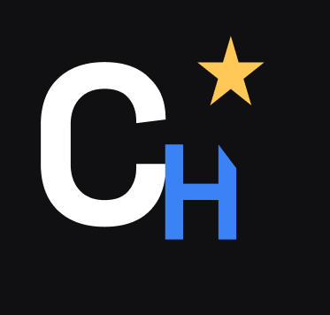

# Marca — CritHit

## Nome

**CritHit**

### Naming rationale

"Crit Hit" (Critical Hit / acerto crítico) é um termo que qualquer jogador reconhece na hora: é aquele ataque que sai com dano extra, o momento de sorte e habilidade que vira o jogo. A gente pegou esse termo e sobrepôs um segundo significado: **"Crit"** também é a raiz de *crítica* e *critique* — exatamente o que o app faz, permitir que jogadores critiquem (no bom sentido) os jogos que jogaram.

O nome funciona em três camadas:

1. **Gamer**: reconhecível instantaneamente por quem joga, sem precisar explicar.
2. **Produto**: comunica a função central do app — dar uma nota e escrever uma crítica.
3. **Memorável**: curto (7 letras), fácil de falar em português e em inglês, funciona como `@crithit` em qualquer rede social e como domínio (`crithit.app`).

Tagline: **"Cada jogo merece uma crítica."**

## Tom de voz

O CritHit fala como um amigo gamer experiente que também manja de crítica — não como uma enciclopédia nem como uma marca corporativa. Diretrizes:

- **Direto e leve**: frases curtas, sem enrolação. Nada de jargão corporativo ("sinergia", "solução disruptiva").
- **Vocabulário gamer com moderação**: termos como *combo*, *loot*, *backlog*, *platinar* aparecem naturalmente, mas sem forçar gíria em toda frase.
- **Encorajador, nunca elitista**: qualquer pessoa pode dar uma nota e escrever duas linhas — o app não julga quem não é "hardcore".
- **Opinativo, mas respeitoso**: incentiva o usuário a ter e defender uma opinião sobre os jogos, sem tom de ataque a quem pensa diferente.

Exemplos de microcopy:

| Contexto | Texto |
|---|---|
| Tela vazia de reviews | "Ainda sem crítica nenhuma. Bora ser o primeiro a dar essa nota?" |
| Confirmação ao salvar review | "Review salva! Combo de bom gosto ativado." |
| Erro genérico | "Deu ruim aqui do nosso lado. Tenta de novo?" |
| Convite para avaliar | "Zerou (ou desistiu de) esse jogo? Conta pra gente quantas estrelas ele merece." |

## Paleta de cores

Base neutra em tons de cinza/preto (referência visual do universo gamer e de apps como Discord/Steam), com acentos coloridos usados com significado — não é "cor por decoração", cada uma marca um estado diferente da interface.

| Token | Hex | Uso |
|---|---|---|
| `background` | `#101012` | Fundo geral do app |
| `surface` | `#19191D` | Cards, listas, campos |
| `surfaceAlt` | `#24242A` | Elementos elevados (modais, app bar, inputs) |
| `coverBackground` | `#22303F` | Fundo da capa de um jogo sem imagem real ainda |
| `primary` (Mana Blue) | `#3B82F6` | Ação primária — botões, ícones e destaques de navegação |
| `accentGold` (Loot Gold) | `#FFC857` | Estrelas de avaliação — a cor mais importante do produto |
| `success` (Combo Green) | `#4ADE80` | Estados positivos (ex: "review salva com sucesso") |
| `danger` (Boss Red) | `#F87171` | Erros e alertas (ex: "falta escolher uma nota") |
| `textPrimary` | `#F2F2F5` | Texto principal sobre fundo escuro |
| `textSecondary` | `#9C9CA6` | Texto de apoio, metadados |

**Regra de uso**: dourado é exclusivo das estrelas de nota (nunca usar em outro lugar, pra manter o significado forte); azul é a cor de ação padrão; verde e vermelho só aparecem em feedbacks de sucesso/erro, nunca como decoração solta.

## Tipografia

- **Títulos e destaques**: `Space Grotesk` (geométrica, moderna, com personalidade — usada em nomes de jogos, títulos de tela e no logotipo).
- **Corpo de texto**: `Inter` (alta legibilidade em telas pequenas, ótima para reviews longas e listas).
- **Fallback no código**: enquanto as fontes customizadas são carregadas via `google_fonts`, o Material 3 usa a família padrão da plataforma como fallback automático — ou seja, o app nunca fica sem tipografia definida.

## Aplicações do logo

- `docs/brand/logo.png` — símbolo oficial: monograma "Ch" (branco + Mana Blue) com uma estrela dourada, sobre fundo escuro. Usado no app (tela inicial) e nesta documentação.
- `assets/branding/logo.png` — a mesma imagem, dentro do projeto Flutter, referenciada em `lib/screens/home_screen.dart`.

> **Próximo passo (opcional)**: essa é a v1 do logo, em PNG. Se o grupo quiser refinar (ajustar proporções, testar em tamanho de ícone bem pequeno), o `docs/GUIA_FIGMA_CRITHIT.md` tem o passo a passo pra recriar como vetor no Figma e exportar um `.svg` — que dá mais nitidez em qualquer tamanho e substitui este PNG sem mudar mais nada.
